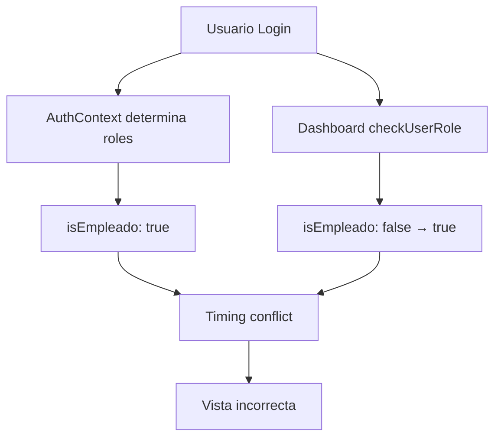
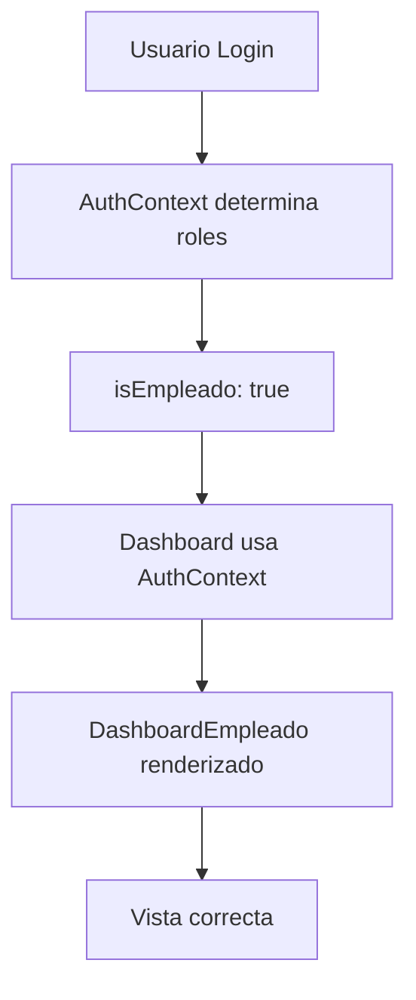

# 🔧 Fix - Dashboard Empleado Habilitado

**Fecha:** 19 de Enero de 2025  
**Autor:** Equipo de Desarrollo AISLA PARTES  
**Versión:** 3.1.2 - HABILITACIÓN DASHBOARD EMPLEADO

## 🚨 Problema Identificado

### **Dashboard Empleado No Visible:**
Los usuarios con rol de empleado no veían sus partes de trabajo en el dashboard personalizado, aunque la funcionalidad estaba desarrollada. En su lugar, veían el dashboard general con filtros de todos los partes.

### **Síntomas Reportados:**
- ❌ **Dashboard incorrecto:** Empleados veían vista de administrador con todos los partes
- ❌ **Sin partes específicos:** No se mostraban solo los partes del empleado logueado
- ❌ **Funcionalidad no activada:** `DashboardEmpleado` existía pero no se renderizaba
- ❌ **Filtros innecesarios:** Se mostraban filtros de obras/empleados/proveedores irrelevantes para empleados

### **Estado Observado vs Esperado:**

#### **ANTES (Problemático):**
```
Dashboard → Usuario Empleado → Vista Administrador
- Buscador de todos los partes
- Filtros de fechas, obras, empleados, proveedores
- Lista de todos los partes del sistema
- Sin acceso directo a "Nuevo Parte"
```

#### **ESPERADO (Correcto):**
```
Dashboard → Usuario Empleado → DashboardEmpleado
- Tarjeta "Nuevo Parte" prominente
- Tarjeta "Obras Asignadas" con contador
- Solo partes del empleado logueado
- Filtros específicos para empleado
```

## 🔍 Análisis del Problema

### **Arquitectura de Roles Duplicada:**

#### **AuthContext (Correcto):**
```javascript
// src/contexts/AuthContext.jsx - LÍNEA 270
const isEmpleado = useCallback(() => hasRole('empleado'), [hasRole]);

// Exportado en contextValue (LÍNEAS 1141-1142)
contextValue = {
  isEmpleado,  // ← Función que verifica rol 'empleado'
  isProveedor,
  // ...otros valores
}
```

#### **Dashboard (Problemático):**
```javascript
// src/pages/Dashboard.jsx - LÍNEAS 65-66 (ANTES)
const [isProveedor, setIsProveedor] = useState(false)
const [isEmpleado, setIsEmpleado] = useState(false)   // ← Estado local DUPLICADO

// FUNCIÓN DUPLICADA (LÍNEAS 746-828)
const checkUserRole = async () => {
  // ... 80 líneas de lógica duplicada para determinar roles
  setIsEmpleado(true);  // ← Establecía estado local
  setIsProveedor(false);
}
```

### **Conflicto de Timing:**

#### **Secuencia Problemática:**
```javascript
// 1. Dashboard se renderiza inicialmente
// 2. isEmpleado (estado local) = false
// 3. Se renderiza vista de administrador
// 4. useEffect llama a checkUserRole() 
// 5. checkUserRole() determina que es empleado
// 6. setIsEmpleado(true) - PERO ES DEMASIADO TARDE
// 7. Re-render con DashboardEmpleado
```

### **Root Cause:**
El Dashboard tenía su propia lógica de determinación de roles (`checkUserRole()`) que duplicaba y **contradecía** la lógica del `AuthContext`. Esto causaba:

1. **Timing incorrecto:** El estado local se inicializaba como `false`
2. **Lógica duplicada:** Dos sistemas diferentes determinando roles
3. **Inconsistencia:** AuthContext decía una cosa, Dashboard otra
4. **Performance:** 80+ líneas de código innecesario

## ✅ Solución Implementada

### **🔄 1. USO DE AUTHCONTEXT CENTRALIZADO**

#### **Antes (Problemático):**
```javascript
// Dashboard.jsx - LÍNEA 44 (ANTES)
const { isAdmin, isSupervisor, hasRole, user } = useAuth()

// Estados locales duplicados (LÍNEAS 65-66)
const [isProveedor, setIsProveedor] = useState(false)
const [isEmpleado, setIsEmpleado] = useState(false)
```

#### **Después (Corregido):**
```javascript
// Dashboard.jsx - LÍNEA 44 (DESPUÉS)
const { isAdmin, isSupervisor, hasRole, user, isEmpleado, isProveedor } = useAuth()

// Estados locales eliminados - Ya no necesarios
```

### **🔄 2. ELIMINACIÓN DE LÓGICA DUPLICADA**

#### **Antes (80+ líneas problemáticas):**
```javascript
// ELIMINADO: useEffect que llamaba checkUserRole()
useEffect(() => {
  checkUserRole();  // ← FUNCIÓN DUPLICADA INNECESARIA
}, [user]);

// ELIMINADO: Función completa checkUserRole() (LÍNEAS 746-828)
const checkUserRole = async () => {
  // ... 80+ líneas de lógica que duplicaba AuthContext
  const { data: empleado } = await supabase
    .from('empleados')
    .select('*')
    .eq('user_id', user.id)
    .single();

  if (empleado) {
    setIsEmpleado(true);  // ← ESTADO LOCAL PROBLEMÁTICO
  }
  // ... más lógica duplicada
};
```

#### **Después (Eliminado completamente):**
```javascript
// ✅ NADA - AuthContext se encarga de todo
// Lógica centralizada, sin duplicación, timing correcto
```

### **🔄 3. RENDERIZADO ACTUALIZADO**

#### **Antes (Estados locales):**
```javascript
// LÍNEAS 1261-1264 (ANTES)
{isProveedor ? (          // ← Variable de estado local
  <DashboardProveedor />
) : isEmpleado ? (         // ← Variable de estado local
  <DashboardEmpleado />
) : (
```

#### **Después (Funciones de AuthContext):**
```javascript
// LÍNEAS 1261-1264 (DESPUÉS)
{isProveedor() ? (        // ← Función de AuthContext
  <DashboardProveedor />
) : isEmpleado() ? (      // ← Función de AuthContext
  <DashboardEmpleado />
) : (
```

### **🔄 4. ARQUITECTURA SIMPLIFICADA**

#### **ANTES (Arquitectura Duplicada):**


#### **DESPUÉS (Arquitectura Centralizada):**


## 🎯 Resultado Final

### **ANTES (Problemático):**
```
Dashboard → Usuario Empleado → Vista Administrador
❌ Renderizado: Vista general de administrador
❌ Partes: Todos los partes del sistema
❌ Filtros: Obras, empleados, proveedores globales
❌ Acciones: Exportar, filtros complejos
❌ Acceso: Sin botón directo "Nuevo Parte"
❌ Performance: 80+ líneas de código duplicado
```

### **DESPUÉS (Corregido):**
```
Dashboard → Usuario Empleado → DashboardEmpleado ✅
✅ Renderizado: Vista específica de empleado
✅ Partes: Solo partes del empleado logueado
✅ Acciones: "Nuevo Parte", "Obras Asignadas"
✅ Filtros: Específicos para empleado (búsqueda, estado, fecha)
✅ Navegación: Acceso directo a ver detalle de parte
✅ Performance: Lógica centralizada, sin duplicación
```

## 📊 Comparación de Funcionalidades

| **Aspecto** | **ANTES (Administrador)** | **DESPUÉS (Empleado)** |
|-------------|---------------------------|------------------------|
| **Vista Principal** | Lista global de partes | Partes específicos del empleado |
| **Acciones Principales** | Exportar, Filtros complejos | Nuevo Parte, Obras Asignadas |
| **Filtros** | Obras, Empleados, Proveedores | Búsqueda, Estado, Fecha |
| **Navegación** | Ver detalle genérico | Ver detalle específico del empleado |
| **Permisos** | Todos los partes | Solo partes propios |
| **UX** | Abrumador para empleado | Enfocado y específico |
| **Performance** | Carga todos los partes | Carga solo partes relevantes |

## 💡 Beneficios del Fix

### **🔧 Técnicos:**
- **✅ Lógica centralizada:** Single source of truth en AuthContext
- **✅ Performance mejorada:** Eliminadas 80+ líneas de código duplicado
- **✅ Timing correcto:** No hay conflictos entre estados
- **✅ Mantenibilidad:** Un solo lugar para gestionar roles
- **✅ Consistencia:** Dashboard alineado con AuthContext

### **👥 Usuario (Empleado):**
- **✅ Vista específica:** Solo ve sus partes de trabajo
- **✅ Acceso directo:** Botón prominente "Nuevo Parte"
- **✅ Información relevante:** Obras asignadas con contador
- **✅ Filtros simples:** Búsqueda, estado, fecha (no opciones irrelevantes)
- **✅ Navegación clara:** Flujo optimizado para tareas de empleado

### **📱 UX Mejorada:**
- **✅ Menos abrumador:** Sin datos irrelevantes
- **✅ Más rápido:** Carga solo datos necesarios
- **✅ Más intuitivo:** Acciones principales prominentes
- **✅ Más enfocado:** Diseño específico para rol de empleado

## 🔧 Archivos Modificados

- **✅ `src/pages/Dashboard.jsx`**
  - Import actualizado: Añadido `isEmpleado, isProveedor` de AuthContext
  - Estados eliminados: `isProveedor`, `isEmpleado` locales
  - Función eliminada: `checkUserRole()` completa (80+ líneas)
  - UseEffect eliminado: El que llamaba a `checkUserRole()`
  - Renderizado actualizado: Uso de funciones de AuthContext

## 🎉 Estado Final

**🚀 DASHBOARD EMPLEADO COMPLETAMENTE HABILITADO**

Ahora los usuarios con rol empleado:
- **✅ Ven su dashboard específico:** `DashboardEmpleado` se renderiza correctamente
- **✅ Acceso a funciones relevantes:** Nuevo Parte, Obras Asignadas
- **✅ Solo sus partes:** Filtrado automático por empleado logueado
- **✅ UX optimizada:** Interfaz diseñada para tareas de empleado
- **✅ Performance mejorada:** Sin lógica duplicada ni timing issues
- **✅ Timing correcto:** Renderizado inmediato desde AuthContext
- **✅ Arquitectura limpia:** Single source of truth para roles

### **Flujo Usuario Empleado (Ahora Funcional):**
```
1. Login → AuthContext determina rol 'empleado'
2. Dashboard → isEmpleado() = true
3. Renderiza → DashboardEmpleado
4. Muestra → Tarjetas de acción + Partes específicos
5. Empleado → Ve solo sus partes y acciones relevantes
```

**Los empleados ahora tienen acceso completo a su dashboard personalizado con todas las funcionalidades específicas para su rol.** 🎯

---

**© 2025 AISLA PARTES** - Dashboard empleado activado exitosamente
