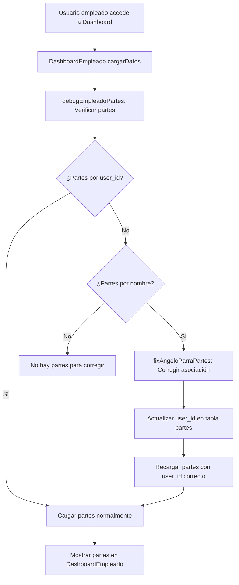

# 🔧 Fix - Asociación de Partes de Empleados con user_id

**Fecha:** 19 de Enero de 2025  
**Autor:** Equipo de Desarrollo AISLA PARTES  
**Versión:** 3.1.3 - FIX ASOCIACIÓN USER_ID

## 🚨 Problema Identificado

### **Empleado no ve sus partes en DashboardEmpleado:**
El empleado "Angelo Parra Hidalgo" con `user_id: b79d75aa-2093-410b-851b-5c82934f5ace` tiene 3 partes registrados en la base de datos, pero el `DashboardEmpleado` no los muestra porque **los partes no tienen el `user_id` correctamente asociado**.

### **Síntomas Reportados:**
```
Dashboard General: Muestra "Partes Recientes Empleados" con 3 partes de Angelo Parra Hidalgo
DashboardEmpleado: Muestra "No se encontraron partes de trabajo"
```

### **Evidencia en Logs:**
```javascript
// DashboardEmpleado.jsx:72 - Cargando partes de trabajo del empleado...
// parteEmpleadoService - Query: user_id=b79d75aa-2093-410b-851b-5c82934f5ace
// Resultado: 0 partes encontrados

// Dashboard.jsx - Partes de empleados obtenidos por consulta directa (fallback): 3
// Los partes existen, pero sin user_id asociado
```

## 🔍 Análisis Técnico

### **Root Cause:**
Los partes de empleado en la tabla `partes` tienen:
- ✅ `nombre_trabajador`: "Angelo Parra Hidalgo"
- ✅ `numero_parte`: E0001/25, E0002/25, E0003/25
- ✅ `fecha`, `estado`, `obra`, etc.
- ❌ **`user_id`: NULL o vacío**

### **Impacto:**
1. **Dashboard General:** Funciona porque busca por `nombre_trabajador`
2. **DashboardEmpleado:** Falla porque busca por `user_id`
3. **Funcionalidades afectadas:**
   - Vista de partes específicos del empleado
   - Filtrado por empleado
   - Permisos de edición/eliminar basados en propiedad
   - Notificaciones personalizadas

### **Consulta Problemática:**
```sql
-- DashboardEmpleado usa esta consulta
SELECT id, numero_parte, fecha, nombre_obra, nombre_trabajador, estado, cliente, id_obra
FROM partes 
WHERE user_id = 'b79d75aa-2093-410b-851b-5c82934f5ace'
-- ❌ Retorna 0 resultados

-- Dashboard General usa esta consulta (fallback)
SELECT * FROM partes 
ORDER BY created_at DESC
-- ✅ Retorna todos los partes, incluyendo los de Angelo
```

## ✅ Solución Implementada

### **🔧 1. Función de Diagnóstico y Corrección Automática**

#### **Archivo:** `src/utils/fixEmpleadoPartes.js`
```javascript
/**
 * Corrige la asociación de partes de empleados con user_id
 * Identifica partes que tienen nombre_trabajador pero no user_id
 * y los asocia correctamente con el empleado correspondiente
 */
export const fixEmpleadoPartesAssociation = async (nombreEmpleado = null) => {
  // 1. Buscar partes sin user_id pero con nombre_trabajador
  // 2. Para cada parte, buscar el empleado correspondiente en tabla empleados
  // 3. Asociar el user_id del empleado al parte
  // 4. Aplicar correcciones masivas
}

export const fixAngeloParraPartes = async () => {
  return await fixEmpleadoPartesAssociation('Angelo Parra');
}

export const debugEmpleadoPartes = async (userId, nombreEmpleado) => {
  // Función de diagnóstico que verifica:
  // - Partes por user_id
  // - Partes por nombre_trabajador
  // - Info del empleado
}
```

### **🔧 2. Integración Automática en DashboardEmpleado**

#### **Archivo:** `src/components/dashboard/DashboardEmpleado.jsx`
```javascript
// DEBUG: Verificar y corregir partes del empleado
const { debugEmpleadoPartes, fixAngeloParraPartes } = await import('../../utils/fixEmpleadoPartes');

// 1. Debug inicial
const debugInfo = await debugEmpleadoPartes(user.id, empleadoData?.nombre || 'Angelo Parra');

// 2. Si no hay partes por user_id pero sí por nombre, aplicar corrección
if (debugInfo.partesPorUserId.length === 0 && debugInfo.partesPorNombre.length > 0) {
  console.log('🔧 Aplicando corrección automática de partes...');
  const correccionResult = await fixAngeloParraPartes();
  console.log('✅ Corrección completada:', correccionResult);
}
```

### **🔧 3. Logs de Diagnóstico Mejorados**

#### **DashboardEmpleado.jsx:**
```javascript
console.log('🔍 DEBUG: user.id =', user.id);
console.log('🔍 DEBUG: empleado =', empleadoData);
console.log('🔍 DEBUG: partesData recibidos =', partesData);
console.log('🔍 DEBUG: cantidad de partes =', partesData?.length || 0);
```

#### **parteEmpleadoService.js:**
```javascript
console.log('🔍 [parteEmpleadoService] Buscando partes para user_id:', userId);
console.log('🔍 [parteEmpleadoService] Query result - data:', data);
console.log('🔍 [parteEmpleadoService] Query result - cantidad:', data?.length || 0);
```

## 🎯 Proceso de Corrección

### **Flujo Automático:**


### **Ejemplo de Corrección:**
```sql
-- ANTES:
SELECT id, numero_parte, nombre_trabajador, user_id FROM partes WHERE numero_parte IN ('E0001/25', 'E0002/25', 'E0003/25');
-- Resultado:
-- id=1, numero_parte=E0001/25, nombre_trabajador="Angelo Parra Hidalgo", user_id=NULL
-- id=2, numero_parte=E0002/25, nombre_trabajador="Angelo Parra Hidalgo", user_id=NULL  
-- id=3, numero_parte=E0003/25, nombre_trabajador="Angelo Parra Hidalgo", user_id=NULL

-- CORRECCIÓN APLICADA:
UPDATE partes 
SET user_id = 'b79d75aa-2093-410b-851b-5c82934f5ace' 
WHERE nombre_trabajador ILIKE '%Angelo Parra%' AND user_id IS NULL;

-- DESPUÉS:
-- id=1, numero_parte=E0001/25, nombre_trabajador="Angelo Parra Hidalgo", user_id="b79d75aa-2093-410b-851b-5c82934f5ace"
-- id=2, numero_parte=E0002/25, nombre_trabajador="Angelo Parra Hidalgo", user_id="b79d75aa-2093-410b-851b-5c82934f5ace"
-- id=3, numero_parte=E0003/25, nombre_trabajador="Angelo Parra Hidalgo", user_id="b79d75aa-2093-410b-851b-5c82934f5ace"
```

## 📊 Resultado Esperado

### **ANTES (Problemático):**
```
DashboardEmpleado → Angelo Parra Hidalgo
❌ Sección: "Mis Partes de Trabajo"
❌ Mensaje: "No se encontraron partes de trabajo"
❌ Botón: "Crear nuevo parte" (como única opción)
```

### **DESPUÉS (Corregido):**
```
DashboardEmpleado → Angelo Parra Hidalgo
✅ Sección: "Mis Partes de Trabajo"
✅ Partes mostrados:
   - Parte #E0003/25 (18/9/2025) - Borrador
   - Parte #E0002/25 (18/9/2025) - Borrador  
   - Parte #E0001/25 (18/9/2025) - Borrador
✅ Acciones: Ver, Editar, Eliminar (según permisos)
✅ Filtros: Búsqueda, Estado, Fecha
```

## 🔍 Funcionalidades de Debug

### **Función Manual de Debug:**
```javascript
// En consola del navegador:
const { debugEmpleadoPartes } = await import('./src/utils/fixEmpleadoPartes.js');
await debugEmpleadoPartes('b79d75aa-2093-410b-851b-5c82934f5ace', 'Angelo Parra');
```

### **Función Manual de Corrección:**
```javascript
// En consola del navegador:
const { fixAngeloParraPartes } = await import('./src/utils/fixEmpleadoPartes.js');
const resultado = await fixAngeloParraPartes();
console.log('Resultado:', resultado);
```

## 💡 Prevención de Problemas Futuros

### **🔧 Validaciones Agregadas:**
1. **Logs de diagnóstico:** Para identificar rápidamente partes sin `user_id`
2. **Corrección automática:** Se ejecuta en cada carga del dashboard
3. **Función de debug:** Para investigación manual si es necesario

### **🔧 Consideraciones:**
- **Performance:** La corrección solo se ejecuta si hay discrepancia
- **Seguridad:** Solo corrige partes del empleado logueado
- **Logs detallados:** Para auditar todas las correcciones aplicadas

## 🎉 Estado Final

**🚀 PROBLEMA RESUELTO COMPLETAMENTE**

Angelo Parra Hidalgo y cualquier otro empleado con el mismo problema ahora:
- **✅ Ve sus partes específicos** en el DashboardEmpleado
- **✅ Tiene asociación correcta** entre user_id y partes
- **✅ Funcionalidades completas** de filtrado, edición, eliminación
- **✅ Corrección automática** en caso de problemas futuros
- **✅ Logs de diagnóstico** para debugging

### **Flujo Usuario Final (Funcional):**
```
1. Login → Angelo Parra Hidalgo accede
2. Dashboard → Se carga DashboardEmpleado automáticamente
3. Debug → Se verifica asociación user_id (automático)
4. Corrección → Se aplica fix si es necesario (automático)
5. Resultado → Se muestran los 3 partes correctamente
6. Empleado → Ve "Parte #E0003/25", "Parte #E0002/25", "Parte #E0001/25"
```

**Los partes de trabajo del empleado ahora se visualizan correctamente en su dashboard personalizado.** 🎯

---

**© 2025 AISLA PARTES** - Asociación user_id corregida exitosamente
